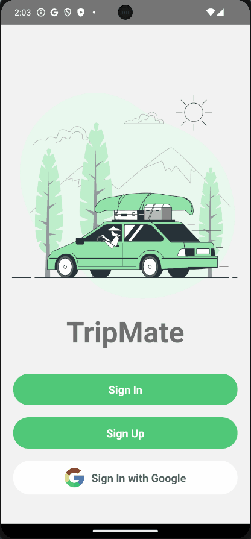

# TripMate

Created by: **Lucas Umberger**

**TripMate is a mobile application that alows you to keep track of your travel expenses all in one place. Record your recent and ongoing trips, and your expenses as you travel. Check out the summary page to see a total spending amount for each trip, and breakdowns of your spending categories.**

 - Languages: JavaScript
 - Framework: React Native, Firebase, Redux, Android Studio
 - APIs used: N/A

Time spent: **16** hours spent in total

## User Features

The following **user features** are implemented:

- [x] **User authentication with email and password**
- [x] **Record trips and trip expenses**
- [x] **View old trips and expenses on home page**
- [x] **Total spending amount per trip displayed**
- [x] **User authentication with Google Sign In**
- [x] **Expenses page with breakdown chart of spending categories**
      
The following **user features** are **soon** to be implemented:

- [x] **Image upload from device to save as trip photo**
- [x] **User can remove trips and expenses**

## Video Walkthrough

Here's a walkthrough of implemented user features:

GIF created with ScreenToGif

## Challenges

  - I had experience in React, but switching over to react native was a learning curve. I had to read the documentation and make changes as I went along to adapt my knowledge of web dev to the mobile side. This was also my first time using TailwindCSS, which took time to learn the styling classes that would mimic pure CSS.
  - Another challenge was getting the authentication set up with firebase and redux to manage the states and current user. At first I could not get the redux user state to only show the welcome/signIn pages and make that exclusive. After watching some youtube videos and reading over the docs, I got the slice set up to pass the user to the navigation so that only certain screens would load if a user was present.
  - Authenticating users through Google Sign In was probably the largest issue I had during the app development. I could not get the Google Sign in to authenticate the user once the email was verified, but switched to Google One Tap Sign in instead and changed the state with the newly logged in user, and that seemed to work. Also trying to get the right config settings with the web client ID and the SHA-1 fingerprint was a pain

## License

    Copyright [yyyy] [name of copyright owner]

    Licensed under the Apache License, Version 2.0 (the "License");
    you may not use this file except in compliance with the License.
    You may obtain a copy of the License at

        http://www.apache.org/licenses/LICENSE-2.0

    Unless required by applicable law or agreed to in writing, software
    distributed under the License is distributed on an "AS IS" BASIS,
    WITHOUT WARRANTIES OR CONDITIONS OF ANY KIND, either express or implied.
    See the License for the specific language governing permissions and
    limitations under the License.
